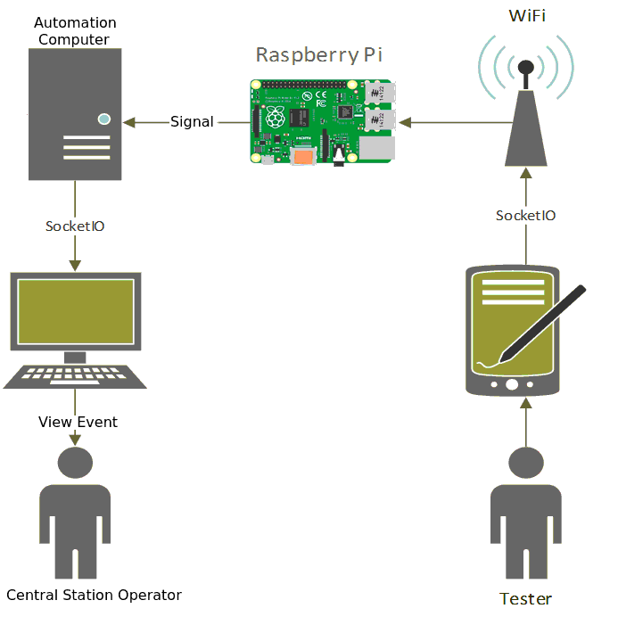
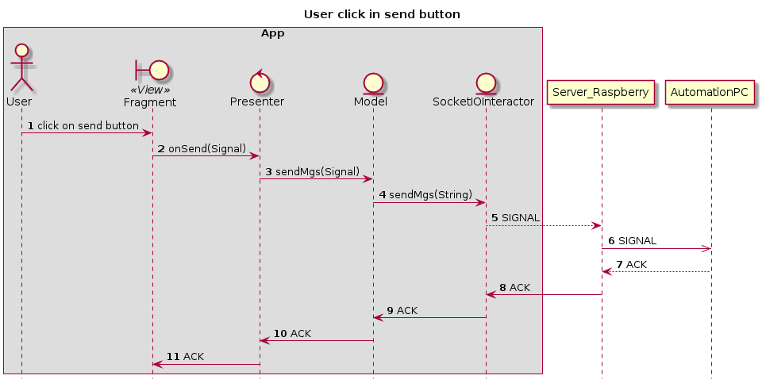
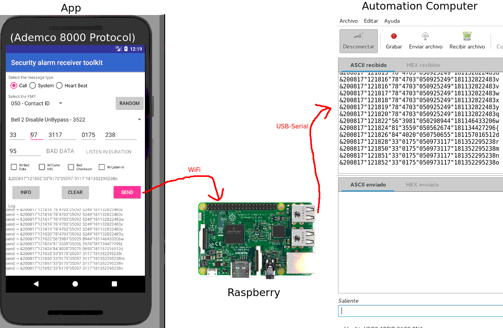
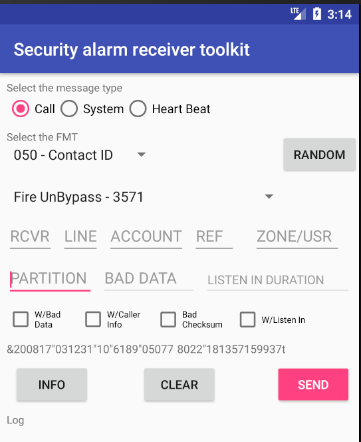

# Security Alarm Receiver Toolkit

This project aims to develop a set of tools to perform tests in alarm monitoring stations and in companies that develop software for them.

It has two great features:
- Generation of signals emulating alarm receivers (Like the Ademco MX8000).
- Signal reception test.

### Generation of signals emulating alarm receivers

The following images show how the different components interact. It can be seen that when the user sends a signal from the application, the Rasbperry receives it and injects it into the automation computer emulating to be an alarm receiver.

Using a serial port monitoring software (like moserial o minicom) we can observe the data received from the raspberry

In this screen you can see the form for creating a signal for the Ademco 8000 protocol

### Raspberry Code

In this repo you will find the code needed to deploy the server on the raspberry:
https://github.com/Eitol/security_alarm_receiver_toolkit_injector

Note: You must configure the raspberry ip in the Constant class located at instant.alarmreceptortoolkitapp.global

(This software is currently in development)
